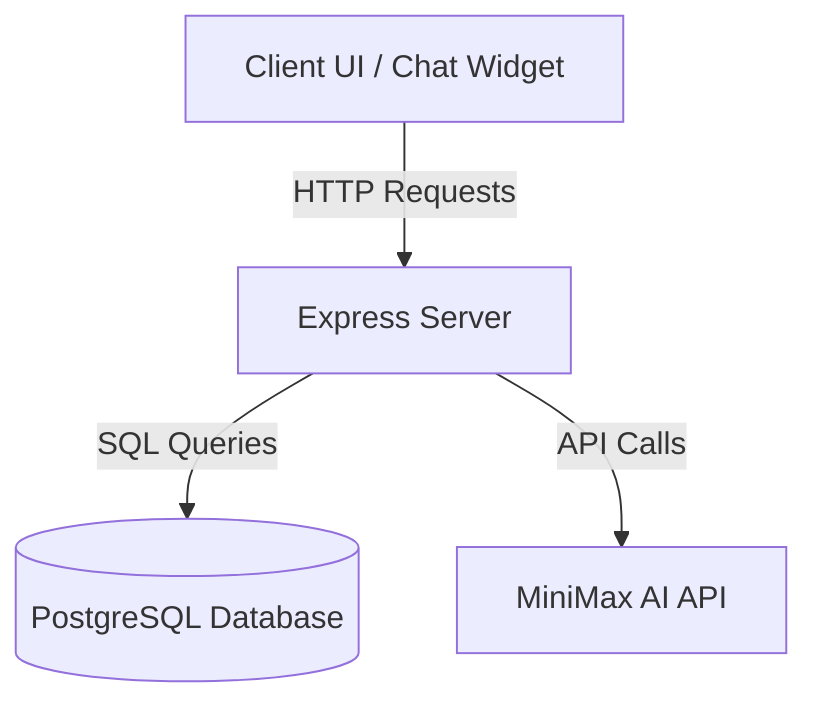

# System Architecture & Core Design

This document details the high-level system design, authentication protocols, state management, caching mechanism, and security policies of the **FD Platform Prototype**.

---

## 1. System Overview

The FD Platform is structured as a client-server web application consisting of a mobile-responsive frontend and an Express-based backend connected to a PostgreSQL database.



---

## 2. Authentication & Session Lifecycles

The application implements two distinct security/audience tiers: **Authenticated Users** and **Anonymous Verified Users**.

### A. Authenticated User Flow (OTP-Less Login)
1. **Request OTP:** The user inputs their mobile number. The client sends a request to `/api/auth/send-otp`.
2. **Verification:** Since this is a demo environment, a universal OTP (`123456`) is accepted. The client requests `/api/auth/verify-otp`.
3. **Session Issuance:** The server returns a JWT signed with the user's `userId` and `phone`. The client stores this JWT in `localStorage` to survive page reloads.
4. **Cache Warm-Up:** Upon login, the server pre-fetches the user's FD bookings from PostgreSQL and stores them in the in-memory cache to ensure instant chat responses.

### B. Anonymous Verified User Flow (Chat-Only Identity)
1. **Verification Request:** An anonymous user clicks "Check my FDs" in the chat widget.
2. **Input Fields:** The widget guides them through a 3-step form requiring:
   - **Mobile Number:** (10 digits)
   - **Date of Birth:** (YYYY-MM-DD)
   - **PAN Number:** (10-char alphanumeric, `AAAAA9999A`)
3. **Strict Database Lookup:** The backend processes `/api/bot/verify` via an **exact match** query:
   ```sql
   SELECT user_id, full_name, mobile_number, pan_number, date_of_birth, kyc_status
     FROM "user"
    WHERE mobile_number = $1 AND date_of_birth = $2 AND pan_number = $3
    LIMIT 1;
   ```
4. **Opaque Token Issuance:** On a successful match, the server generates a 24-byte cryptographically secure random base64url string. It stores this token in an in-memory `Map` mapping the token to `{ userId, expiresAt }`.
5. **Session Handling:** The token is returned to the client and stored in `sessionStorage` (cleared automatically on page refresh). Subsequent chat queries append this token as `anonToken` to retrieve personalized data without a formal site-wide login.

---

## 3. In-Memory Cache Design

To optimize database read loads and ensure sub-second response times for chat commands, the backend maintains an in-memory cache (`backend/src/bot/cache.js`).

- **Cache Lifetime (TTL):** Stale entries are cleared after **30 minutes** of idle time.
- **Eviction Sweep:** A periodic background timer runs every 60 seconds to sweep and delete expired tokens/cache entries.
- **Cache Isolation:** Cache entries are keyed strictly by `userId`.
- **Explicit Wiping:** The cache is explicitly cleared when:
  - The user calls `/api/auth/logout`.
  - A new login request occurs (avoiding cross-contamination of sessions).
  - The API receives a `/api/bot/cache/clear` request.

---

## 4. Security & Hardening Model

The platform implements a multi-layered security model to protect user data:

1. **Read-Only Chat Operations:** The bot endpoints (`/api/bot/ask`, `/api/bot/menu`) do not contain any write paths. They execute `SELECT` statements only.
2. **Strict Parameter Validation:** Before querying the database, inputs (such as phone numbers, PANs, and dates of birth) are parsed using regular expressions:
   - Phone: `/^[6-9]\d{9}$/`
   - PAN: `/^[A-Z]{5}\d{4}[A-Z]$/`
   - DOB: `/^\d{4}-\d{2}-\d{2}$/`
3. **PII Masking:** Personally Identifiable Information (PII) is masked in stdout logs to protect user privacy (e.g., `97****00`, `****-**-10`, `AB****23C`).
4. **Rate Limiting:**
   - The `/api/bot/verify` endpoint is restricted to **5 attempts per IP per hour** to prevent brute-forcing user profiles.
   - LLM queries are limited (typically **20 per hour for authenticated users** and **5 per hour for anonymous users**).
5. **No PII Sent to LLM:** User profiles, IPs, and names are stripped before forwarding requests to the external LLM provider. Only the user's plain text query is sent.
